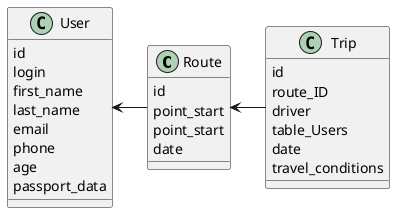

# Компонентная архитектура
<!-- Состав и взаимосвязи компонентов системы между собой и внешними системами с указанием протоколов, ключевые технологии, используемые для реализации компонентов.
Диаграмма контейнеров C4 и текстовое описание. 
-->
## Компонентная диаграмма

```plantuml
@startuml
!include https://raw.githubusercontent.com/plantuml-stdlib/C4-PlantUML/master/C4_Container.puml

AddElementTag("microService", $shape=EightSidedShape(), $bgColor="CornflowerBlue", $fontColor="white", $legendText="microservice")
AddElementTag("storage", $shape=RoundedBoxShape(), $bgColor="lightSkyBlue", $fontColor="white")

Person(user, "Пользователь")

System_Ext(program, "Клиентское ПО", "Node.js, Java, PHP, Ruby on Rails")

System_Boundary(conference_site, "Сервис поиска попутчиков") {
   'Container(program, "Клиентский веб-сайт", ")
   Container(client_service, "Сервис авторизации", "C++", "Сервис управления пользователями", $tags = "microService")    
   Container(post_service, "Сервис маршрутов", "C++", "Сервис управления маршрутами", $tags = "microService") 
   Container(blog_service, "Сервис поездок", "C++", "Сервис управления поездками", $tags = "microService")   
   ContainerDb(db, "База данных", "MySQL", "Хранение данных о маршрутах, поездках и пользователях", $tags = "storage")
   
}

Rel(user, program, "Регистрация, просмотр/изменение информации о своих поездках/маршрутах")

Rel(program, client_service, "Работа с пользователями", "localhost/person")
Rel(client_service, db, "INSERT/SELECT/UPDATE", "SQL")

Rel(program, post_service, "Работа с маршрутами", "localhost/pres")
Rel(post_service, db, "INSERT/SELECT/UPDATE", "SQL")

Rel(program, blog_service, "Работа с поездками", "localhost/conf")
Rel(blog_service, db, "INSERT/SELECT/UPDATE", "SQL")

@enduml
```
## Список компонентов  

### Сервис авторизации
**API**:
-	Создание нового пользователя
      - входные параметры: login, пароль, имя, фамилия, email, обращение (г-н/г-жа), паспортные данные, водительские права (для водителей), фото, номер телефона
      - выходные параметры: отсутствуют
-	Поиск пользователя по логину
     - входные параметры:  login
     - выходные параметры: имя, фамилия, email, обращение (г-н/г-жа), паспортные данные, водительские права (для водителей), фото, номер телефона
-	Поиск пользователя по маске имени и фамилии
     - входные параметры: маска фамилии, маска имени
     - выходные параметры: login, имя, фамилия, email, обращение (г-н/г-жа), паспортные данные, водительские права (для водителей), фото, номер телефона
- Поиск пользователя по паспортным данным / водительскому удостоверению:
      - входные параметры: паспортные данные / водительские права (для водителей)
      - выходные параметры: login, имя, фамилия, email, обращение (г-н/г-жа), паспортные данные, водительские права (для водителей), фото, номер телефона 
- Поиск пользователя по номеру телефона:
      - входные параметры: номер телефона
      - выходные параметры: login, имя, фамилия, email, обращение (г-н/г-жа), паспортные данные, водительские права (для водителей), фото, номер телефона 

### Сервис маршрутов
**API**:
- Создание маршрута
  - Входные параметры: точка отправления, точка прибытия
  - Выходыне параметры: маршрут
- Получение списка всех поездок
  - Входные параметры: пользователь, маршрут, желаемое время отправки
  - Выходные параметры: список со всеми поездками, удовлетворяющим параметрам маршрута и желаемому времени

### Сервис постов
**API**:
- Создание поста
  - Входные параметры: заголовок поста, автор, блог, содержания поста, дата создания
  - Выходные параметры: идентификатор поста
- Получение списка постов в блоге
  - Входные параметры: блог
  - Выходные параметры: массив с постами (идентификатор, заголовок поста, автор, блог, содержания поста, дата создания)
- Получение поста
  - Входнае параметры: идентификатор поста
  - Выходные парамтеры: заголовок поста, автор, блог, содержания поста, дата создани
- Изменение поста
  - Входные параметры: идентификатор поста, заголовок поста, автор, блог, содержания поста, дата создания
  - Выходные параметры: отсутствуют


### Модель данных
